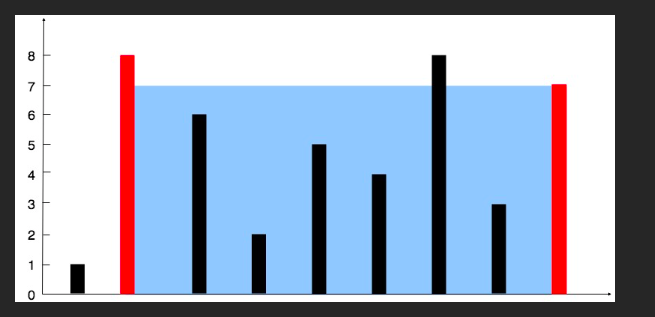

# 11. Container With Most Water
**Medium**

## Question
You are given an integer array `height` of length `n`. There are `n` vertical lines drawn such that the two endpoints of the `ith` line are `(i, 0)` and `(i, height[i])`.

Find two lines that together with the x-axis form a container, such that the container contains the most water.

Return the maximum amount of water a container can store.

**Notice** that you may not slant the container.

## Example
### Example 1

```yaml
Input: height = [1,8,6,2,5,4,8,3,7]
Output: 49
```
**Explanation**: The above vertical lines are represented by array [1,8,6,2,5,4,8,3,7]. In this case, the max area of water (blue section) the container can contain is 49.

### Example 2
```yaml
Input: height = [1,1]
Output: 1
```

## Constraints
- `n == height.length`
- `2 <= n <= 10e5`
- `0 <= height[i] <= 10e4`

## Solution
After reading this problem, we could see that our goal is to just get the biggest area of rectangle. We have two options of either getting the longest width rectangle or a highest height rectangle. We can use a two-pointers method to solve this problem.

We can use the pointer to point at the two side of the array. We then slowly shift the two pointers closer to each other until they collide. During the shifting, we also try to find the area of the current rectangle and keep track of the biggest one. I decided to shift the left pointer forward if the height of the line on the left is smaller than the right. Shift the right leftward otherwise.

The time complexity for this algorithm will be `O(n)` and space complexity of `O(1)`.
