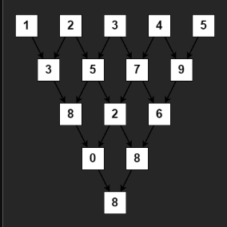

# 2221. Find Triangular Sum of an Array
**Medium**

## Question
You are given a **0-indexed** integer array `nums`, where `nums[i]` is a digit between `0` and `9` (**inclusive**).

The triangular sum of `nums` is the value of the only element present in `nums` after the following process terminates:

- Let `nums` comprise of `n` elements. If `n == 1`, **end** the process. Otherwise, create a new **0-indexed** integer array `newNums` of length `n - 1`.
- For each index `i`, where `0 <= i < n - 1`, **assign** the value of `newNums[i]` as `(nums[i] + nums[i+1]) % 10`, where `%` denotes modulo operator.
- **Replace** the array `nums` with `newNums`.
- **Repeat** the entire process starting from step 1.

Return the triangular sum of `nums`.

## Example
### Example 1

```yaml
Input: nums = [1,2,3,4,5]
Output: 8
Explanation:
The above diagram depicts the process from which we obtain the triangular sum of the array.
```

### Example 2
```yaml
Input: nums = [5]
Output: 5
Explanation:
Since there is only one element in nums, the triangular sum is the value of that element itself.
```

## Constraints
- `1 <= nums.length <= 1000`
- `0 <= nums[i] <= 9`

## Solution
Looking at the problem, it seems that the return requirement is just to return a single number through all the iteration. Instead of create a `new array` with with the size of `n-1` for `n = len(current_array)` each time, we will end up with a space complexity of `O(n**2)`. Since we can see that in the `new_array`, `new_array[i] = current_array[i] + current_array[i+1]`, we can just constantly update our current array instead. After that, we can just return the `array[0]` as the answer. With this solution, we will have a time complexity of `O(n**2)` and space complexity of `O(1)`.

