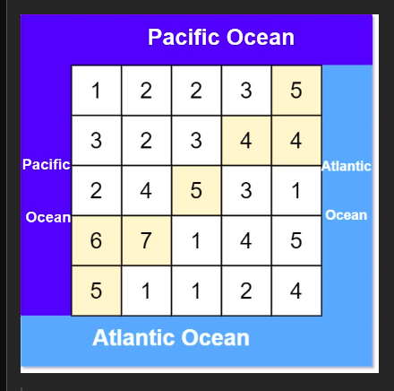
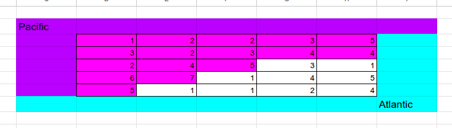
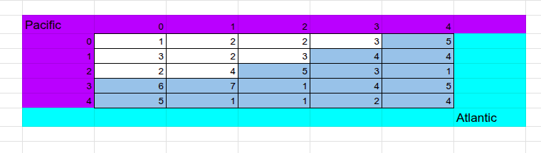
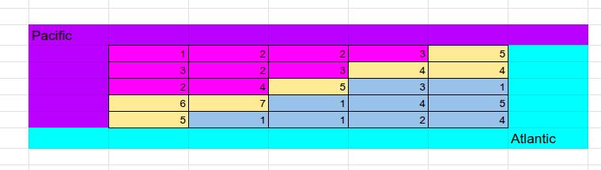

# 417. Pacific Atlantic Water Flow
**Medium**

## Question
There is an `m x n` rectangular island that borders both the **Pacific Ocean** and **Atlantic Ocean**. The **Pacific Ocean** touches the island's left and top edges, and the Atlantic Ocean touches the island's right and bottom edges.

The island is partitioned into a grid of square cells. You are given an `m x n` integer matrix `heights` where `heights[r][c]` represents the **height above sea level** of the cell at coordinate `(r, c)`.

The island receives a lot of rain, and the rain water can flow to neighboring cells directly north, south, east, and west if the neighboring cell's height is **less than or equal to** the current cell's height. Water can flow from any cell adjacent to an ocean into the ocean.

Return a **2D** list of grid coordinates `result` where `result[i] = [ri, ci]` denotes that rain water can flow from cell `(ri, ci)` to **both** the Pacific and Atlantic oceans.

## Example
### Example 1


```yaml
Input: heights = [[1,2,2,3,5],[3,2,3,4,4],[2,4,5,3,1],[6,7,1,4,5],[5,1,1,2,4]]
Output: [[0,4],[1,3],[1,4],[2,2],[3,0],[3,1],[4,0]]

Explanation: The following cells can flow to the Pacific and Atlantic oceans, as shown below:
[0,4]: [0,4] -> Pacific Ocean
       [0,4] -> Atlantic Ocean
[1,3]: [1,3] -> [0,3] -> Pacific Ocean
       [1,3] -> [1,4] -> Atlantic Ocean
[1,4]: [1,4] -> [1,3] -> [0,3] -> Pacific Ocean
       [1,4] -> Atlantic Ocean
[2,2]: [2,2] -> [1,2] -> [0,2] -> Pacific Ocean
       [2,2] -> [2,3] -> [2,4] -> Atlantic Ocean
[3,0]: [3,0] -> Pacific Ocean
       [3,0] -> [4,0] -> Atlantic Ocean
[3,1]: [3,1] -> [3,0] -> Pacific Ocean
       [3,1] -> [4,1] -> Atlantic Ocean
[4,0]: [4,0] -> Pacific Ocean
       [4,0] -> Atlantic Ocean
Note that there are other possible paths for these cells to flow to the Pacific and Atlantic oceans.
```

### Example 2
```yaml
Input: heights = [[1]]
Output: [[0,0]]
Explanation: The water can flow from the only cell to the Pacific and Atlantic oceans.
```

## Constraints
- `m == heights.length`
- `n == heights[r].length`
- `1 <= m,n <= 200`
- `0 <= heights[r][c] <= 10e5`

## Solution
When first reading the question, my mind immediately think that this is a graph problem that can be solve with some form of graph traversal BFS/DFS. Then I was thinking of maybe if we cache the traversal then we do not have to keep moving into nodes that we already check if it connected to Pacific and Atlantic Ocean. But then that would be complicate for a node to hold the information to keep track if its connected to aech of the Ocean.

I still know that I would want to perform a graph traversal; however, I did not want to run through each elements. Instead of perform a graph traversal from a given node to the Ocean, we can try to find which nodes can the Ocean leaded up to. By doing this, we can do two different set of graph traversal for each the Pacific and Atlantic Ocean. Then we can find the common nodes between the two the two graph traversal and that would be our answer.

It would looks something like this:

All the nodes that can lead to Pacific Ocean

All the nodes that can lead to Atlantic Ocean

The common nodes that are both in Pacific Ocean set and Atlantic set

With this algorithm, we will have a time complexity of `O(rows * cols)` and a space complexity of `O(rows * cols)`
