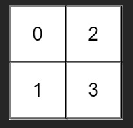

# 778. Swim in Rising Water
**Hard**

## Question
You are given an `n x n` integer matrix `grid` where each value `grid[i][j]` represents the elevation at that point `(i, j)`.

It starts raining, and water gradually rises over time. At time `t`, the water level is `t`, meaning any cell with elevation less than equal to `t` is submerged or reachable.

You can swim from a square to another 4-directionally adjacent square if and only if the elevation of both squares individually are at most `t`. You can swim infinite distances in zero time. Of course, you must stay within the boundaries of the grid during your swim.

Return the minimum time until you can reach the bottom right square `(n - 1, n - 1)` if you start at the top left square `(0, 0)`.

## Example
### Example 1

```yaml
Input: grid = [[0,2],[1,3]]
Output: 3
Explanation:
At time 0, you are in grid location (0, 0).
You cannot go anywhere else because 4-directionally adjacent neighbors have a higher elevation than t = 0.
You cannot reach point (1, 1) until time 3.
When the depth of water is 3, we can swim anywhere inside the grid.
```

### Example 2

```yaml
Input: grid = [[0,1,2,3,4],[24,23,22,21,5],[12,13,14,15,16],[11,17,18,19,20],[10,9,8,7,6]]
Output: 16
Explanation: The final route is shown.
We need to wait until time 16 so that (0, 0) and (4, 4) are connected.
```

## Constraints
- `n == grid.length`
- `n == grid[i].length`
- `1 <= n <= 50`
- `0 <= grid[i][j] < n**2`
- Each value `grid[i][j]` is **unique**

## Solution
After reading the question, the immediate thing that came into my mind is Graph Traversal, especially finding the shortest path to go from `grid[0][0]` to `grid[n-1][n-1]`. I decided to use Dijkstra's algorithm as my main algorithm for this problem.

In the problem, we can assumed that the total cost of each node, or each square, is the highest amount of time it take to swim that position from `grid[0][0]`. With that, we can use a priority queue to traverse through the whole grid until the first time we reach `grid[n-1][n-1]`. That will be our shortest time to reach that destination.

Since `row = col` in this problem, the algorithm will take us a time complexity of `O(n**2 logn)` and a space complexity of `O(n**2)`
