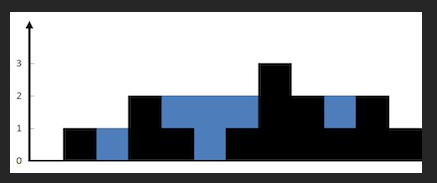

# 42. Trapping Rain Water
**Hard**

## Question
Given `n` non-negative integers representing an elevation map where the width of each bar is `1`, compute how much water it can trap after raining.

## Example
### Example 1

```yaml
Input: height = [0,1,0,2,1,0,1,3,2,1,2,1]
Output: 6
```
**Explanation**: The above elevation map `(black section)` is represented by array `[0,1,0,2,1,0,1,3,2,1,2,1]`. In this case, 6 units of rain water `(blue section)` are being trapped.

### Example 2
```yaml
Input: height = [4,2,0,3,2,5]
Output: 9
```

## Constraints
- `n == height.length`
- `1 <= n <= 2 * 10e4`
- `0 <= height[i] <= 10e5`

## Solution
After reading the question, I can see that it is somewhat similar to [container with most water](../container_with_most_water/README.md). We would start with shifting the left pointer and the right pointer toward each other. However, with this, we do not keep track of the highest line but the second highest. The idea is that once we shift either the left or right pointer, if the new value is smaller than the second highest, we can calculate the amount of water we have in that index. Since theoretically, if every points in between the left and right pointers is smaller than the second highest, then we can calculate the total amount of water that way. If the smaller point of the left or right pointer is bigger than the second highest point, then we will replace the point with it. We will shift the pointers using the same rule as the other problem.

With this algorithm, we will have a time complexity of `O(n)` and a space complexity of `O(1)`.
