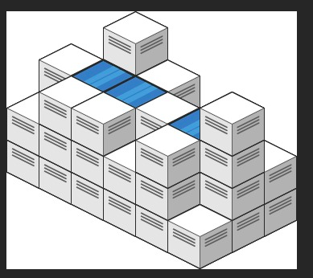
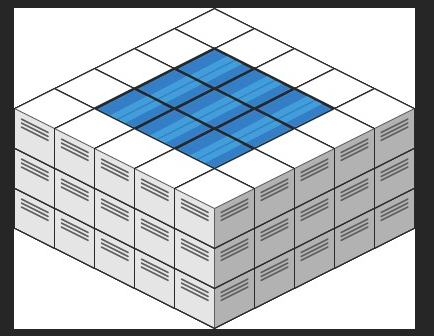
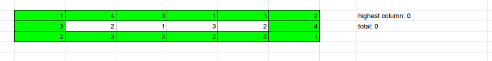
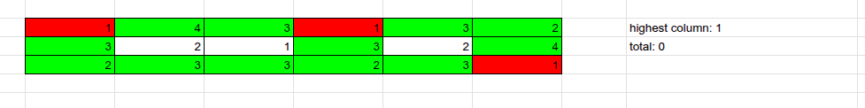
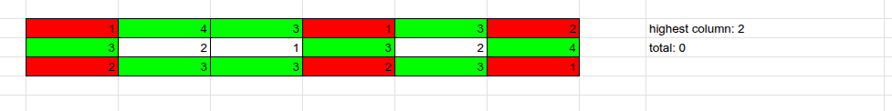
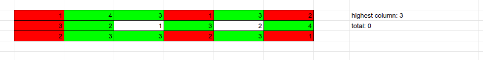
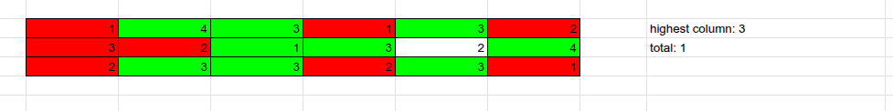
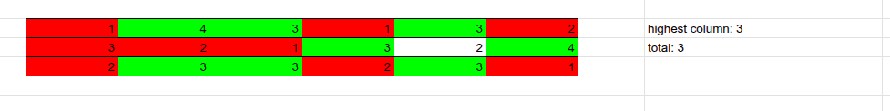

# 407. Trapping Rain Water II
**Hard**

## Question
Given an `m x n` integer matrix `heightMap` representing the height of each unit cell in a 2D elevation map, return the volume of water it can trap after raining.

## Example
### Example 1

```yaml
Input: heightMap = [[1,4,3,1,3,2],[3,2,1,3,2,4],[2,3,3,2,3,1]]
Output: 4
```
**Explanation**: After the rain, water is trapped between the blocks. We have two small ponds 1 and 3 units trapped. The total volume of water trapped is 4.

### Example 2

```yaml
Input: heightMap = [[3,3,3,3,3],[3,2,2,2,3],[3,2,1,2,3],[3,2,2,2,3],[3,3,3,3,3]]
Output: 10
```

## Constraints
- `m == heightMap.length`
- `n == heightMap[i].length`
- `1 <= m, n <= 200`
- `0 <= heightMap[i][j] <= 2 * 10e4`

## Solution
First thing that I get out of this question is that every columns on the edges of an elevation map will not hold any water. We only need to focus on calculate the water height of the middle of the elevation map. To solve this problem, we can imagine each element of the array as a node and its neighbor nodes would be every surrounding nodes expect adjacent nodes. We can perform a min-heap priority queue BFS algorithm to find the total amount of water.

We start the queue by adding the edge nodes and its position inside the matrix. Every time we pop a node out of the queue, we update the highest column of so far and add the difference of the height column against the current node value. We then get its neighbor nodes and add them into the queue if we had not visit that node yet. By the time we empty the queue, we will have the total amount of water that will be hold inside.

We can see each step of the algorithm look something like this:


Adding all the edges nodes into the queue


Starting with the lowest elements and add any un-visit nodes, and updating the highest column


Keep adding more nodes into the queue


Keep adding nodes into the queues and updating the highest column


Visit the lowest node in the queue, since it's smaller than the highest, we can now update the total water trap. Then add its neighbor nodes into the queue


Doing the same thing as the previous step, and we can keep going until the queue is empty

With this Algorithm, we will have a time complexity of `O(rows * cols log (rows * cols))`. The space complexity would be `O(rows * cols)`.
