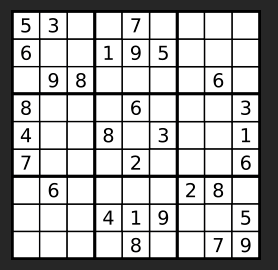

# Valid Sudoku
**Medium**

## Question
Determine if a `9 x 9` Sudoku board is valid. Only the filled cells need to be validated **according to the following rules**:

- Each row must contain the digits `1-9` without repetition.
- Each column must contain the digits `1-9` without repetition.
- Each of the nine `3 x 3` sub-boxes of the grid must contain the digits `1-9` without repetition.

**Note**:
- A Sudoku board (partially filled) could be valid but is not necessarily solvable.
- Only the filled cells need to be validated according to the mentioned rules.

## Example
### Example 1


```yaml
Input: board =
[["5","3",".",".","7",".",".",".","."]
,["6",".",".","1","9","5",".",".","."]
,[".","9","8",".",".",".",".","6","."]
,["8",".",".",".","6",".",".",".","3"]
,["4",".",".","8",".","3",".",".","1"]
,["7",".",".",".","2",".",".",".","6"]
,[".","6",".",".",".",".","2","8","."]
,[".",".",".","4","1","9",".",".","5"]
,[".",".",".",".","8",".",".","7","9"]]

Output: true
```

### Example 2
```yaml
Input: board =
[["8","3",".",".","7",".",".",".","."]
,["6",".",".","1","9","5",".",".","."]
,[".","9","8",".",".",".",".","6","."]
,["8",".",".",".","6",".",".",".","3"]
,["4",".",".","8",".","3",".",".","1"]
,["7",".",".",".","2",".",".",".","6"]
,[".","6",".",".",".",".","2","8","."]
,[".",".",".","4","1","9",".",".","5"]
,[".",".",".",".","8",".",".","7","9"]]

Output: false
```
**Explanation**: Same as Example 1, except with the **5** in the top left corner being modified to **8**. Since there are two 8's in the top left 3x3 sub-box, it is invalid.

### Constraints:
- `board.length == 9`
- `board[i].length == 9`
- `board[i][j]` is a digit `1-9` or `.`.

## Solution
To validate a Sudoku, we will need to validate the board by its rows, cols, and the 9 sub-boxes inside of the Sudoku. We will need to validate the board by its rows, cols, and the 9 sub-boxes inside of it. We can use a nested for loop to check for each of the validation. However, that would mean that we need to run the nested for loop 3 times. Instead of doing that, we can try to check all three requirements within one nested for loop.

The first thing that we need to do is to figure out a way to check if a number is already inside the a certain row, column, or sub-box. I decided to use a hash set in order to dynamically keep track of the number.

Since character represent a different position for each of the row, column, and sub-box, we can keep track of them by visualizing that the outer loop if for each row position. The inner loop will be representing each column. For the sub-box, it is a bit trickier. If you think of how the inside loop is checking for 9 numbers of each row, each 3 consequences number representing a row inside a sub-box. I visualized my sub-box as 0-8 going from left to right, top to bottom. To determine which sub-box that we are in, we can perform a little math of `floor(row_index / 3)*3 + floor(col_index / 3)`. This would help us correctly assign each character that we encounter to the correct sub-box position.
