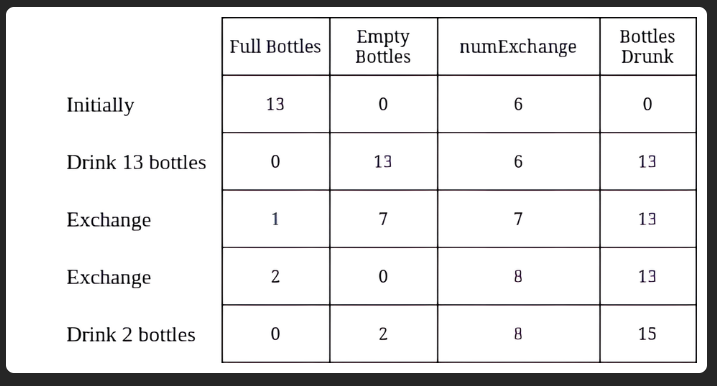
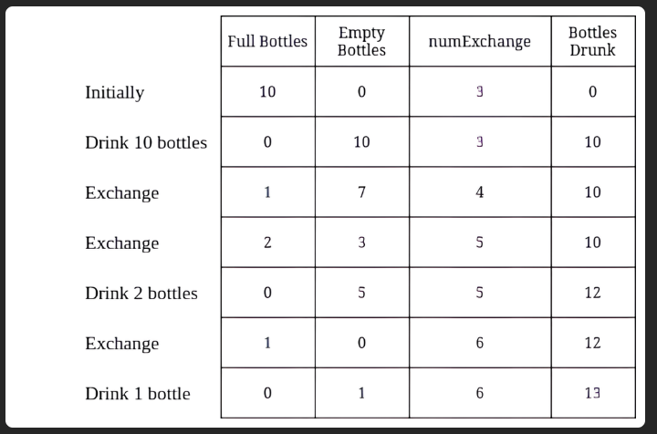

# 3100. Water Bottles II
**Medium**

## Question
You are given two integers `numBottles` and `numExchange`.

`numBottles` represents the number of full water bottles that you initially have. In one operation, you can perform one of the following operations:

- Drink any number of full water bottles turning them into empty bottles.
- Exchange `numExchange` empty bottles with one full water bottle. Then, increase `numExchange` by one.

Note that you cannot exchange multiple batches of empty bottles for the same value of `numExchange`. For example, if `numBottles == 3` and `numExchange == 1`, you cannot exchange `3` empty water bottles for `3` full bottles.

Return the **maximum** number of water bottles you can drink.

## Example
### Example 1

```yaml
Input: numBottles = 13, numExchange = 6
Output: 15
Explanation: The table above shows the number of full water bottles, empty water bottles, the value of numExchange, and the number of bottles drunk.
```

### Example 2

```yaml
Input: numBottles = 10, numExchange = 3
Output: 13
Explanation: The table above shows the number of full water bottles, empty water bottles, the value of numExchange, and the number of bottles drunk.
```

## Constraints
- `1 <= numBottles <= 100`
- `1 <= numExchange <= 100`

## Solution
Since this is quite similar to the last problem of [Water Bottle](../water_bottles/README.md), we can use a similar algorithm to solve this. Expect that for this problem, we increase the `numExchange` by one every time we exchange a bottle. Therefore, instead of checking a while loop with `(emptyBottles / numExchange) > 0`, we do `emptyBottles >= numExchange`. Since for every loop, we can exchange 1 drinkable bottle and increase the exchange requirement by one, we can set the `emptyBottles = emptyBottles - numExchange + 1` the `+1` is for the new drinkable bottle that got exchange during that process.
With this algorithm, we will have a time complexity of `O(n)` and space complexity of `O(1)`.
