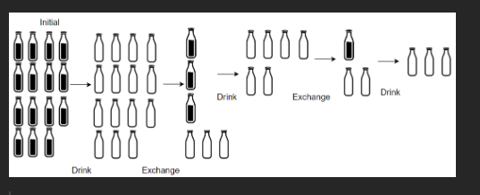

# 1518. Water Bottles
**Easy**

## Question
There are `numBottles` water bottles that are initially full of water. You can exchange `numExchange` empty water bottles from the market with one full water bottle.

The operation of drinking a full water bottle turns it into an empty bottle.

Given the two integers `numBottles` and `numExchange`, return the maximum number of water bottles you can drink.

## Example
### Example 1

```yaml
Input: numBottles = 9, numExchange = 3
Output: 13
Explanation: You can exchange 3 empty bottles to get 1 full water bottle.
Number of water bottles you can drink: 9 + 3 + 1 = 13.
```

### Example 2

```yaml
Input: numBottles = 15, numExchange = 4
Output: 19
Explanation: You can exchange 4 empty bottles to get 1 full water bottle.
Number of water bottles you can drink: 15 + 3 + 1 = 19.
```

## Constraint
- `1 <= numBottles <= 100`
- `2 <= numExchange <= 100`

## Solution
After reading the question and examples, especially in example 2, we can see that the algorithm will keep going until we do not have enough empty bottles to be exchanged for water bottles. That means that we will need to use a loop in the algorithm, a counter for the total number of water bottles had been drank, and a counter to keep track of the amount of empty bottles. Since we will always guaranty to drink a least the initial amount of the water bottles, we can then set that as out current empty bottles amount. For the loop, we will check at the beginning of each loop if the `empty_bottles / numExchange > 0`. If it is then we can just add that number to the total number of drank bottles, and update the `empty_bottles` with the sum of the modulus of `empty_bottles` by the `numExchange` and the amount of exchanged bottle.

This solution will yield us a time complexity of `O(logn)` and space complexity of `O(1)`.
